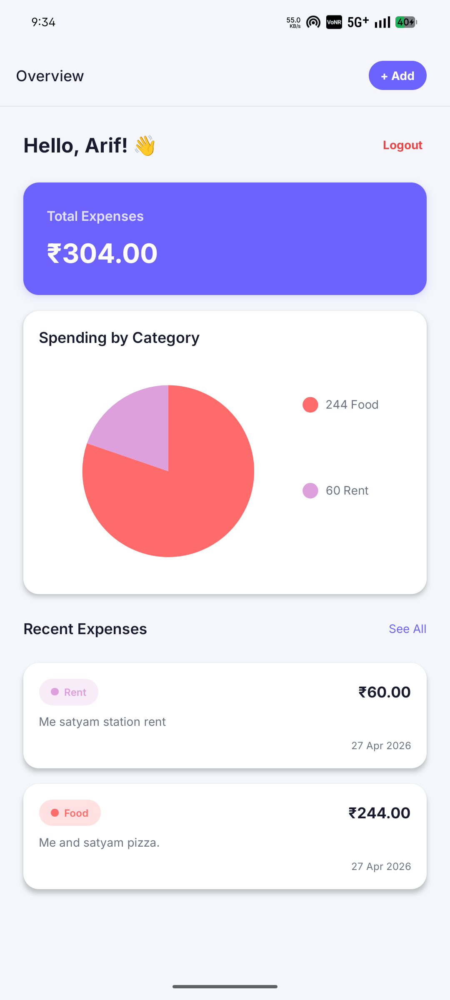
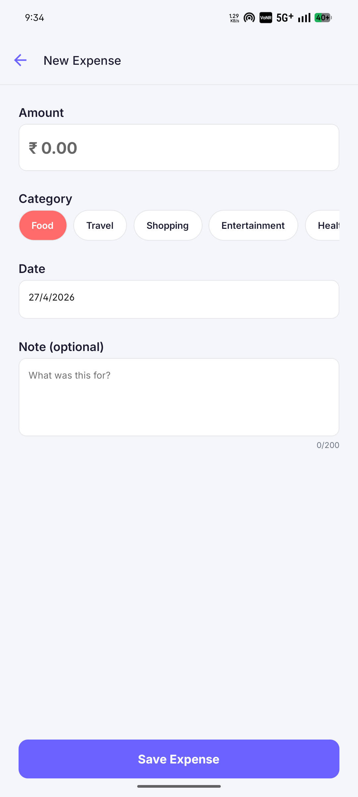

# 💸 Expense Tracker App

> A full-stack **Expense Tracker Mobile App** built with **React Native (Expo)** + **Node.js**  
> Track your daily expenses, visualize spending by category, and manage your finances — all in one place.

---

## 🚀 Features

- 🔐 User Authentication (Register / Login with JWT)
- ➕ Add, Edit & Delete Expenses
- 📊 Dashboard with Total Expense Summary
- 🥧 Category-wise Spending (Pie Chart)
- 📅 Date-wise Expense Tracking
- 📝 Optional Notes per Expense
- 🏷️ Multiple Categories — Food, Travel, Shopping, Entertainment, Health & more
- 📱 Clean, Modern Mobile UI

---

## 📱 Screenshots

| Dashboard | Add Expense |
|-----------|-------------|
|  |  |  |

---

## 🛠️ Tech Stack

### Frontend
- [React Native](https://reactnative.dev/) (Expo)
- Context API — State Management
- React Navigation — Screen Routing
- React Native Chart Kit — Pie Chart

### Backend
- [Node.js](https://nodejs.org/)
- [Express.js](https://expressjs.com/)
- [MongoDB](https://www.mongodb.com/) + Mongoose
- JWT — Authentication & Authorization

---

## 📂 Project Structure

```
Expense-Tracker/
│
├── frontend/               # React Native (Expo) App
│   ├── src/
│   │   ├── components/     # Reusable UI components
│   │   ├── screens/        # App screens (Dashboard, AddExpense, etc.)
│   │   ├── context/        # Global state (AuthContext, ExpenseContext)
│   │   └── services/       # API call functions
│   └── App.js
│
├── backend/                # Node.js REST API
│   ├── controllers/        # Route logic
│   ├── models/             # Mongoose schemas
│   ├── routes/             # API route definitions
│   └── middleware/         # Auth middleware (JWT)
│
└── .gitignore
```

---

## ⚙️ Installation & Setup

### Prerequisites
- Node.js >= 16
- MongoDB (local or Atlas)
- Expo CLI (`npm install -g expo-cli`)

---

### 1️⃣ Clone the Repository

```bash
git clone https://github.com/arry043/Expense-Tracker.git
cd Expense-Tracker
```

---

### 2️⃣ Setup Backend

```bash
cd backend
npm install
```

Create a `.env` file in the `backend/` directory:

```env
PORT=5000
MONGO_URI=your_mongodb_connection_string
JWT_SECRET=your_jwt_secret_key
```

Start the backend server:

```bash
npm run dev
```

---

### 3️⃣ Setup Frontend

```bash
cd frontend
npm install
npx expo start
```

Scan the QR code with **Expo Go** app on your phone.

> ⚠️ Update the API base URL in `frontend/src/services/api.js` to point to your backend server.

---

## 🔗 API Endpoints

| Method | Endpoint | Description |
|--------|----------|-------------|
| POST | `/api/auth/register` | Register new user |
| POST | `/api/auth/login` | Login & get JWT token |
| GET | `/api/expenses` | Get all expenses |
| POST | `/api/expenses` | Add new expense |
| PUT | `/api/expenses/:id` | Update expense |
| DELETE | `/api/expenses/:id` | Delete expense |

---

## 🎯 Future Improvements

- [ ] 📈 Monthly analytics & spending reports
- [ ] ☁️ Cloud sync & data backup
- [ ] 🔔 Expense reminders & notifications
- [ ] 🌙 Dark mode support
- [ ] 📤 Export expenses as CSV/PDF

---

## 🙌 Author

**Mohd Arif Ansari**

[](https://github.com/arry043)
[](https://linkedin.com/in/arryquerry)

---

## ⭐ Show Some Love

If you found this project useful, drop a ⭐ on GitHub — it really helps!
